# pythonStudy

Pythonの学習用

※特に表記のない限りはPython3前提

## 言語仕様、文法関連

* 用語
    * Python: 言語仕様
    * CPython: Pythonで最も普及している実装（C言語で実装）
        * [wikipedia](https://ja.wikipedia.org/wiki/Python)見ると、他にもPython実装は複数ある模様
    * IPython: Pythonの非常に強力な対話型シェル

* 関数定義
    * https://note.nkmk.me/python-function-def-return/
    * プロパティのsetter/getterはめんどくさい（C#比）

* 型ヒント
    * https://qiita.com/icoxfog417/items/c17eb042f4735b7924a3
    * https://docs.python.org/ja/3/library/typing.html

* 内包表記
    * map(), filter()等で書くことも可能だが、速度面では内包表記が優れているらしい

* インクリメント/デクリメント
    * 対応していない
    * https://www.deep-rain.com/programming/python/1772

* 文字列
    * フォルダパスを書く際は、raw文字列で書くのがとりあえずは楽か
        * 記載例  
        `foo = r"c:\temp"`
        * ただしraw文字列は末尾が「\」だとシンタックスエラーになる  
        （C#の `@"hoge"` とは仕様が異なるので注意。この辺PythonはWindowsではいまいち感ある）  
        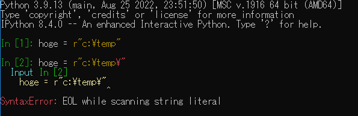

* 配列とリストの違い
    * 配列は固定長で定義時の型のみ
    * リストは動的配列で型はなんでも良い
        * C#のSystem.Collections.Generic.List<System.Object>型が近いかも
    * 両者はメモリ確保の仕方が違う

* 変数代入の挙動
    * https://www.learning-nao.com/?p=2384
        * =での代入は参照渡し
        * df.copy()でディープコピー

* メモリ、ヒープ、スタック周り関連
    * 整数はオブジェクトらしい・・・
        * というかすべての型がオブジェクト
    * （おそらくCpythonについては）値の表現はCの実装依存らしい  
    https://docs.python.org/ja/3/library/array.html  
        > 値の実際の表現はマシンアーキテクチャ (厳密に言うとCの実装) によって決まります。値の実際のサイズは itemsize 属性から得られます。
    * 公式のドキュメント  
    https://docs.python.org/ja/3/c-api/memory.html
    * これ詳しい
        * https://rushter.com/blog/python-garbage-collector/
        * CPythonは参照カウンタ方式で世代別GCを実装しているようだ。整数がオブジェクト云々も書かれてる  
    * [wikipedia](https://ja.wikipedia.org/wiki/Python)に結構書かれている

* pythonのソースコードのリポジトリ
    * どこにあるのかよくわからないが、ここでダウンロードはできる  
        https://www.python.org/downloads/source/
    * とりあえず中身見るとC言語

* docstring （C#のドキュメントコメント的な機能 / \<summary\>...\</summary\>的なの）
    * https://maku77.github.io/python/env/docstring.html
    * https://note.nkmk.me/python-docstring/

## 機械学習関連

一般的な流れ（コンペ想定）

* データの内容を確認
    * 各項目の意味
    * 欠損値の有無
    * 連続データ、カテゴリ値など
    * ...など
* EDA
    * データを解析可能な状態に変換する
        * pandasやseaborn用に文字列のカテゴリデータを数値に変換するなども必要
    * 様々な切り口でデータを見る
        * カテゴリデータ
            * ヒストグラムなど
        * 連続データ、離散データ
            * 散布図など
    * 特徴を新規に作って目的変数との相関を見る
    * ...など
* 学習
    * ハイパーパラメータ調整
        * GridSearchCV
        * Outuna
    * 汎化性能確認
        * k分割交差検証
        * 層化k分割交差検証
    * ...など
* Submit
    * submit用のデータを作って投稿


### 学習データ、検証データの作成

```python
# 変数dataは pandas.core.frame.DataFrame 型とする

# 説明変数、目的変数に分割する例
x_explanatory = data.drop("target_col")
y_target = data["target_col"]

# 説明変数、目的変数に分割する例：ColumnsをListで一旦摂ってきて、Lists指定で分割するパターン
cols = data.columns.tolist()
cols.remove("target_col")
x_explanatory = data[cols]
y_target = data['target_col']

# 学習データ、検証データの作成
# stratify：学習データ・検証データそれぞれの正解ラベルの割合を揃える（データの偏りを回避する）
# random_state：int型を指定する。データ分割の再現性を確保する（再現性不要な場合は指定しなくてもよい）
# test_size：分割の割合を変更可能（デフォルトは75%-25%）
x_train, x_test, y_train, y_test = train_test_split(x_explanatory, y_target, stratify = y_target, random_state = 42)
```

### 学習データ：モデルのパラメータをチューニング

まずはデフォ設定でパッケージのbaseモデルで学習させてみて、おおよその精度を把握する。（実務ではよくやることらしい）

* Scikit-learn RandomForest
    * クラス分類: RandomForestClassifier()
    * 回帰分析: RandomForestRegressor()
* XGBoost
    * クラス分類: XGBClassifier()
    * 回帰分析: XGBRegressor()

### 検証データ：モデルの予測精度を測定

predict()で検証データを使って予測の精度を測定する。
このとき、予測で用いたデータは使用しない。

score()、accuracy_score()等で精度を取得可能。

* 分類
    * Accuracy
    * f値
        * 分類問題ではこれを見ることが多い
    * 混同行列
    * ROC曲線
        * 分類モデルの閾値をずらしたときの結果を見るもの
            * FPR(False Positive Rate)
            * TPR(True Positive Rate)
            * 良いモデルはFPRが低い時点でTPRが高いらしい
        * scikit-learn.roc_curve()
        * このサイトがわかりやすい
            * https://blog.kikagaku.co.jp/roc-auc
    * AUC
        * ROC曲線の下側の面積
        * 理想的なモデルは1になり、完全にランダムに予測だと0.5、正解と真逆の予測だと0
        * scikit-learn.roc_auc_score()
    * classification_report()で一括で各種指標を見れる
        * 適合率(precision)、再現率(recall)、F1スコア、正解率(accuracy)、マクロ平均、マイクロ平均
        * macro avg、f値は実務では結構見る
        * weighted avgはあまり見ない
    * confusion_matrix
        * scikit-learnの結果は一般的な混同行列と出方が違うらしい（ポジティブ・ネガティブの位置が違う）  
        参考: Qiita 【入門者向け】機械学習の分類問題評価指標解説(正解率・適合率・再現率など) https://qiita.com/FukuharaYohei/items/be89a99c53586fa4e2e4  
        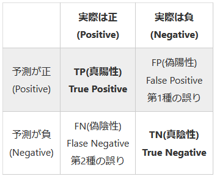
    
* 線形回帰モデル
    * MSE
    * RMSE
    * MAE
    * MAPE
    * R2

### 学習したモデルの可視化

* scikit-learn feature_importances_プロパティ
    * 決定木系のアルゴリズムを選択したとき、特徴量（説明変数）の重要度を算出
* XGB feature_importances_プロパティ
    * scikit-learn同様？たぶん
* XGB plot_importance()
    * グラフ表示までまとめてやってくれる
    * importance_type引数で重要度算出アルゴリズムを変更可能 weight or gain or cover
        * gainオプションはfeature_importances_プロパティ同様になる
    * 公式リファレンス: https://xgboost.readthedocs.io/en/stable/python/python_api.html
        * > ”weight” is the number of times a feature appears in a tree  
        * > ”gain” is the average gain of splits which use the feature  
        * >”cover” is the average coverage of splits which use the feature where coverage is defined as the number of samples affected by the split

* 参考: 学習曲線、適合率-再現率、ROC曲線などのグラフを一括で出す
    * https://clover.fcg.world/2016/03/28/2939/

### データの事前整形

* データクリーニング
    * フォーマットの統一（全角、半角とか）
    * 不要な列の削除（IDなど）
    * 定義外な値の見直し
    * 欠損値の補完
        * https://qiita.com/FukuharaYohei/items/9830d5760595619352a5
        * 欠損値の補完は良し悪し（やらないという選択肢もある）
* データ統合（複数のデータを扱いやすく統合したりする）
* データ変換（文字列を数値に変換したりする）
* 特徴量エンジニアリング（説明変数を加工して新しい説明変数を作ったりなど）
    * 一般的に、説明変数を増やすと精度向上しやすくなる＆過学習しやすくなる
    * データの偏りは正規分布の形が理想
        * https://uribo.github.io/practical-ds/02/numeric.html  
            > 具体的には線形回帰モデルでは、出力から得られる値の誤差が正規分布に従うことを仮定します。そのため正規分布とは異なる形状の分布をもつデータ、例えば離散値ではその仮定が成立しないことが可能性があります。この問題を解決するため、元のデータを正規分布に近似させるという特徴量エンジニアリングが有効になります。  
            > 良い特徴量というのはデータの特徴を強く反映します。連続的な数値の二値化あるいは離散化により、モデルの精度を改善できる見込みがあります。また数値以外のテキストや画像データを数値化した際、さらなる特徴量エンジニアリングが必要になることがあります。つまり数値データの処理は特徴量エンジニアリングの中で最も基本的な技と言えます。  
            > ～略～  
            > スケール変換では変数のばらつきを元にする変換のために変換後の値でも分布は変わりません。しかし対数変換ではデータの分布が変化します。
    * 対数化の手法
        * https://omathin.com/100knock-61-62/
            * 0は扱えないので一般的には1を追加してから対数化する
                * 常用対数化: numpy.log10()
                    * ex: `df_sales_amount['amount_log10'] = np.log10(df_sales_amount['amount']+1)`
                * 自然対数化: numpy.log()
                    * ex: `df_sales_amount['amount_loge'] = np.log(df_sales_amount['amount']+1)`
            * 対数への変換では、基本的に自然対数を使用するらしい
    * 相関が高すぎる説明変数を減らしてみる
    * 不均衡データの調整
        * 不均衡データとは
            * https://atmarkit.itmedia.co.jp/ait/articles/2208/31/news039.html
                * > 一般化された明確な基準はないが、二値分類であれば少数派クラスが以下のような感覚
                    > * 1％未満＝重度の不均衡データ
                    > * 1％以上～20％未満＝中度の不均衡データ
                    > * 21％以上～40％未満＝軽度の不均衡データ
                * 用語
                    > * アンダーサンプリング（Undersampling）： 多数派クラスを少数派クラスの数と同じくらいまで（もしくは不均衡が弱まるまで）減らすこと。ダウンサンプリング（Downsampling）とも呼ぶ
                    > * オーバーサンプリング（Oversampling）： 少数派クラスを多数派クラスの数と同じくらいまで（もしくは不均衡が弱まるまで）増やすこと。アップサンプリング（Upsampling）とも呼ぶ
        * アップサンプリング / オーバーサンプリング
            * https://qiita.com/eigs/items/9ed36b5fc2913110e940
            * https://qiita.com/eigs/items/8ae0970afe188a1124d1
            * https://qiita.com/tempester08/items/d84ce8d423919a0e5239
                * SMOTEやる前に、テストデータは分離しておくようにという話
                    * 特徴量エンジニアリングやるとき、学習データとテストデータ両方にやらないとカラム構成が変わると思うんだけど、なにか楽なやり方あるのかな・・・
        * ダウンサンプリング
        * 損失関数の調整
            * class_weight
                * https://www.haya-programming.com/entry/2018/05/17/123000
* ...など

### EDA

* まずやるべきこと
    * https://qiita.com/takubb/items/e18ea4f7c4ecc8be4a5f
    * trainとtestのデータは縦に連結した上でEDAした方がよいかも
        * trainだけ見ていても結局testの方も気になってしまって作業の無駄感ある
* https://qiita.com/ryo111/items/bf24c8cf508ad90cfe2e
* Titanic
    * 思ってなかった観点で見てる人がいたりする
        * https://qiita.com/jun40vn/items/d8a1f71fae680589e05c
    * 初心者がKaggle Titanicで上位1.5%(0.83732)以内に入るアプローチ解説
        * https://qiita.com/shiroino11111/items/bc3889fa38ff32d46c13
        * https://qiita.com/shiroino11111/items/fb6aa6b7dba2ddc3ce04
        * https://qiita.com/shiroino11111/items/21bf1303587eeae0fc30

#### pandas DataFrame

* 欠損値確認
    * `df.isnull().sum()`
* 要約統計量
    * `df.describe()`
    * `Kaggleのチュートリアル第6版`だと、trainとtest(←目的変数が入ってない)を縦に連結した状態で見ていた
        * 縦の連結: `pd.concat([train, test], axis=0, sort=False)`
    * describe()の引数
        * https://note.nkmk.me/python-pandas-describe/
        * percentiles: 任意の分位点指定可能
        * include: "all"を指定するとすべての型が見れる。"O"だとオブジェクト型
        * 公式: https://pandas.pydata.org/docs/reference/api/pandas.DataFrame.describe.html  
        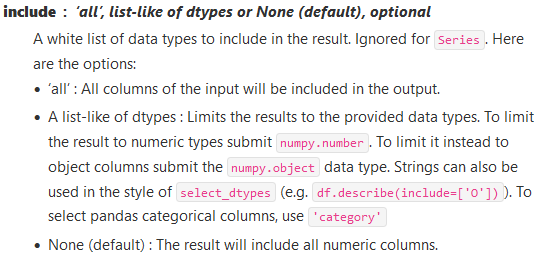
* 部分一致
    * 正規表現そのまま使える
        * デフォルトで大文字小文字区別してるっぽい
        * df.str.contains('[a-z]+')
        * df.str.match()もある
        * 機能見る限りエンジンの実装は.NETと同じ系統くさい
            * 書いてあった https://learn.microsoft.com/ja-jp/dotnet/standard/base-types/details-of-regular-expression-behavior
* 複数の値（リスト）でまとめて絞る
    * int型の列に対して `df.str.match("^[0123]$")` みたいにやると `Can only use .str accessor with string values!` と怒られてしまう。。
        * こういうときは `df.isin([0, 1, 2])` みたいにやればおｋ
* エラー  
    ```
    A value is trying to be set on a copy of a slice from a DataFrame.
    Try using .loc[row_indexer,col_indexer] = value instead
    ```
    * https://qiita.com/FukuharaYohei/items/b3aa7113d08858676910
    * チェーンでつなげると発生しやすくなる模様
    * 対処法は .loc[] 使う
* pandas重いとき
    * numpyでも似たようなことはできる模様
        * https://qiita.com/nkay/items/6778bb6a6400ed985aa0

#### pandas ProfileReport()

* 解説
    * https://datatechlog.com/how-to-use-pandas-profiling/
* to_file()でhtmlファイルに出力可能。  
    * ファイルサイズが大きい場合、Chrome系ブラウザだと out of meomry を起こすことがあるので、その場合はFirefoxで試してみる。
* オプション
    * 相関を出さない: 
        ```
        df.profile_report(
            title="Report without correlations",
            correlations=None,
        )
        ```
    * オプション一覧
        * https://pandas-profiling.ydata.ai/docs/master/pages/advanced_usage/available_settings.html
    * correlationsの有無、explorativeの有無、いずれも大して実行時間かわらない気がするのと、生成されるHTMLファイルのサイズは対して違いがない
        * サイズや速度が気になるときは `minimal=True` を設定するのが効果的な気がする
    * Overview - Alertsの意味
        * High cardinality: データの総数に比してデータの種類が多い
        * High correlation: ある列との相関が高い
        * Missing: 欠損値が多い
        * Uniform
        * Unique
        * Zeros

#### seaborn

seaborn: Matplotlibのラッパーライブラリ

* countplot
* heatmap
* pairplot

#### one-hot-encoding

* pandas get_dummies()
    * drop_first = Trueにすると、生成される列が一つ減る
    * マルチコ(multicollinearity)
        * https://clover.fcg.world/2016/03/28/2939/
* scikit-learn OneHotEncoder()

### 次元削減、次元圧縮

* スケール変換
    * 機械学習時、データの分布が異なるデータを扱うときはほぼ必須
        * Scikit-learn StandardScaler().fit_transform() ※他にもいくつかのスケール変換方法あり
        * https://helve-blog.com/posts/python/scikit-learn-feature-scaling/
    * 重要
        * スケール変換はtrain, testデータを別々にやってはいけない
        * 分散、平均、最大値、最小値などの情報は、train, testデータともに同じ状態にすることが重要
* scikit-learn PCA() fit_transform()
    * PCAはあらかじめスケール変換することが多い
* scikit-learn TSNE() fit_transform()
* 可視化は、二次元 or 三次元

### 学習モデル

* 勾配ブースティング決定木系（GBDT）
    * 全般基礎知識
        * https://qiita.com/kuroitu/items/57425380546f7b9ed91c
        * https://www.acceluniverse.com/blog/developers/2019/12/gbdt.html
        * https://www.youtube.com/watch?v=u0IIqeNZOXY
    * 特徴
        * https://doctorsato.com/python_gbdt/
            * 欠損値を扱うことができる
            * パラメータチューニングをしなくとも精度がでやすい
            * 不要な特徴量を追加しても精度が落ちにくい
    * LightGBM
        * https://lightgbm.readthedocs.io/
        * XGBoost同様、勾配ブースティング
        * 予測精度を保ったまま処理時間が高速されている（しかもCPUで）
            * https://rightcode.co.jp/blog/information-technology/lightgbm-useful-for-kaggler
            * 深さ優先探索っぽい感じ
            * LightGBMは、専用のデータセットに入れることで処理速度が上がるそう
        * GPU使う場合はaptコマンド・・・？（pipじゃない？）
            * 公式チュートリアル https://lightgbm.readthedocs.io/en/latest/GPU-Tutorial.html
        * パラメータチューニング
            * https://qiita.com/c60evaporator/items/351188110f328ff921b9
    * XGBoost
        * 以下は重要
            * max_depath
        * early_stopping
            * 早めに打ち切ることで過学習を防ぐ
    * Catboost
        * カテゴリカル変数の扱いに強みあるが、実務やコンペではあまり使われていない模様？
        * GPU使うならLightGBMより簡単に導入できるっぽい？
        * https://qiita.com/tanreinama/items/5e3eca5cf5e01169e5da

### パラメータチューニング

パラメータチューニングは序盤から行うのはあまり適切でない。

パラメータチューニングやる前に、特徴量エンジニアリングなどを行うのが精度改善につながりやすい。

ブースティング系は、ハイパーパラメータの調整による精度向上分は小さいと言われおり、特徴量エンジニアリングが有効らしい。

* ランダムフォレスト
    * 以下はほぼ必須っぽい
        * max_depath
            * 深すぎても過学習してしまう（7くらいがよいらしい）
            * scikit-learnのデフォルト値はNONE = 無限
        * n_estimators
    * 各パラメータ詳細: https://data-science.gr.jp/implementation/iml_sklearn_random_forest.html
* scikit-learn GridSearchCV()
    * param_grid: 探索対象ハイパーパラメータの辞書・リスト
    * scoring: 評価指標（デフォルト値はaccuracy。必要に応じてf1など適切なものを選択）
    * CV: 交差検証の回数
    * best_estimator_プロパティで、成績の良かったパラメータを取得できる
* 特徴量の取捨選択
    * https://qiita.com/Qwertyutr/items/9a02d2416bd8f3fae860
        > * 統計的な側面で特徴量選択→ SeletKBest（など。他にもあります）
        > * 機械学習の側面で特徴量選択→RFE（など。ほかにもあります）

自動化

* ハイパーパラメータの探索＆特徴量エンジニアリング  https://qiita.com/Hironsan/items/30fe09c85da8a28ebd63


### その他

* Numpy便利関数
    * argsort(): 引数で指定した配列をソートした際の、元の配列のインデックス位置を返す
    * NumPy.ndarrayオブジェクトのインデクサの添字で、NumPy.ndarray型を渡せる
    * NumPy.cut(), qcut()でビニング処理が可能  
    前処理で使用することはわりとあるらしい
    * slice, loc, iloc, at, iat
        * https://note.nkmk.me/python-pandas-at-iat-loc-iloc/
    * 条件抽出の手法
        * https://note.nkmk.me/python-pandas-query/

* XGBoost
    * early_stopping_round
        * 1.6.0以降は、XGBClassfierなどのコンストラクタで指定するかset_paramsで指定する

* グラフ表示
    * Matplotlibの軸の指数表記の設定
        * https://grapebanana.com/matplotlib-axis-11306/
        * http://www.yamamo10.jp/yamamoto/comp/Python/library/Matplotlib/basic/setting/index.php#INIT-SET
    * パターン: seaborn使用
        ```
        sns.histplot(x="BILL_AMT1", data=data, element='step')
        ```
    * パターン
        ```
        df.hist() #全カラム対象
        plt.show()
        ```
    * パターン:
        ```
        data["カラム名"].hist() #特定カラム指定
        plt.tight_layout() #グラフ同士が重ならないようにする
        plt.show()
        ```
    * bins、階級数
        * スタージェスの公式
            * https://tanuhack.com/seaborn-histgram/

## パッケージ

* インストールされるフォルダ
    * `.\lib\site-packages` っぽい？
* 一括アップデート
    * `conda update --all`

* pipコマンドを使う場合
    * 常にこれを実行しておくのがよいらしい？ `python -m pip install --upgrade pip setuptools`
    * 一括アップデート
        * Linuxだとシェルでごにょごにょだが、Windowsのcmdだとめんどくさい
        * pip-reviewというパッケージ入れると楽になれるらしい
            * https://zenn.dev/kittybbit/articles/bf8dd1db0e307d
* condaのアップデート
    * `conda update -n base conda`
* pandas-profiling
    * なぜか `conda install -c conda-forge pandas-profiling` だと1.4.1系
    * `pip install pandas-profiling`
* XGBoost
    * https://xgboost.readthedocs.io/en/stable/install.html#python
    * 2022/09時点 `conda install -c conda-forge py-xgboost` だと1.5.0になる
        * `conda install -c conda-forge py-xgboost==1.6.2` だと `conda-forge/win-64::py-xgboost-1.6.2-cpu_py39ha538f94_0` になる  
        cpu onlyバージョン・・・？
            * ここ見ると linux-64 しか無い・・・  
            https://anaconda.org/conda-forge/py-xgboost-gpu  
            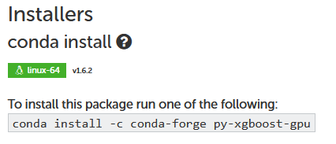
    * pipだとGPUサポートバージョンが含まれている模様  
    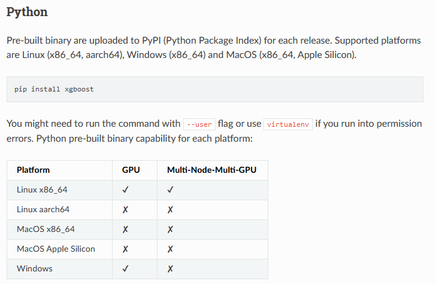

## バージョン管理

* 実験結果の管理、整理
    * Weights & Biases (wandb) がよいらしい？
        * 個人なら無料

* コードのバージョン管理
    * GitHub（普段使ってるので）

## 文字コード関連

### pyファイルの文字コード設定

コード内で日本語文字列が出てくるのであれば、ファイルの文字コードをutf-8にするのがたぶん楽。  
※BOMありにして良いのかはよくわからない

コードの一行目で文字コードを明記する方法もある。ぐぐったら以下がよくまとまっていた。  
https://qiita.com/KEINOS/items/6efc1147b917d7811b5b

## ロギングフレームワーク

Python標準ライブラリ内でロギング用ライブラリが整備されている。

https://docs.python.org/ja/3/howto/logging.html

https://docs.python.org/ja/3/howto/logging.html#configuring-logging

* フォーマッタ、ハンドラ
    * https://www.python.ambitious-engineer.com/archives/693
    * https://www.tohoho-web.com/python/logging.html


## アプリケーション設定

py, ini, jsonのパターンが多そう。
iniはConfigParserで処理できる。
* https://kodocode.net/python-begin-settings/


## リフレクション系

* 変数名取得
    * locals, globals
* 備忘
    * https://qiita.com/icoxfog417/items/bf04966d4e9706eb9e04
    * https://docs.python.org/ja/3/c-api/reflection.html
* スクリプトからインストールされているモジュールを確認
    * https://qiita.com/pashango2/items/ef6c50dd0f91a63cf519


## CUDA

* XGBoostでのGPU使用
    * CUDA Toolkitを入れる必要がある
    * condaでインストールされるxgboostは1.5.0だが、GPU非サポート
        ```
        xgboost.core.XGBoostError: [09:12:50] c:\windows\temp\abs_557yfx631l\croots\recipe\xgboost-split_1659548953302\work\src\common\common.h:157: XGBoost version not compiled with GPU support.
        ```
    * GPUのベンチマーク
        * Windowsのanaconda 3だと、`benchmark_tree.py`は入ってないっぽい
        * XGBoostのGitHubリポジトリには入っているのでここから落とせる
        * "Anaconda Prompt (anaconda3)" から以下実行すればよい
            ```
            python tests/benchmark/benchmark_tree.py --tree_method=gpu_hist
            python tests/benchmark/benchmark_tree.py --tree_method=hist
            ```
    * XGBClassifier()がGPU使う設定だと遅い
        * VisualStudio2022でのデバッグ実行でも、Anaconda Promptからの実行でも、実行時間変わらない
            * `tree_method="gpu_hist"`だと12分くらいかかる処理が、`tree_method="hist"`だと2分くらいになる  
            ・・・？？🤔
        * benchmark_tree.py だと、GPUはCPUの半分以下の処理時間で高速
        * 原因不明
            * 相性？ https://teratail.com/questions/296378
        * 自分でビルドする場合の備忘
            * https://sekailab.com/wp/2018/06/29/installation-xgboost-to-winwdows10-gpu-support/
            * https://xgboost.readthedocs.io/en/latest/build.html#building-on-windows
* CUDA
    * https://developer.nvidia.com/cuda-gpus
        * 対応しているGPUは以下箇所で確認可能  
        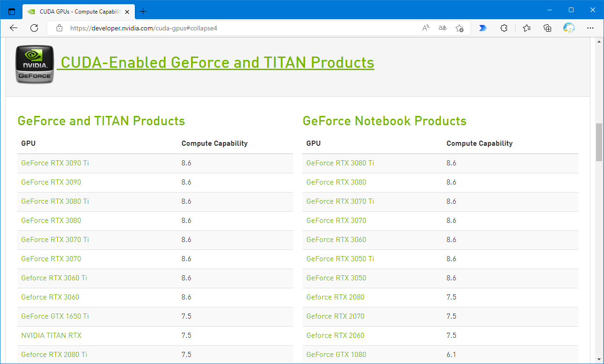
        * オフライン環境用だとバイナリがでかい
            * CUDA 11で2.5GBある
        * network環境用のインストーラを使うのが吉
            * 以下は「Disable Usage Collection」で問題ない気はする  
            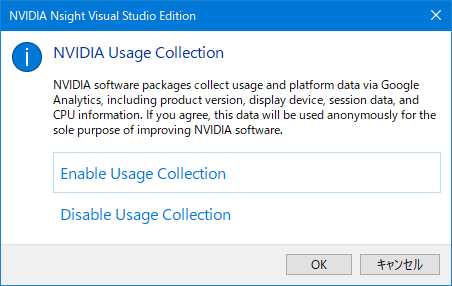
    * 古いバージョンはこちら  https://developer.nvidia.com/cuda-toolkit-archive

## AnacondaやめてMinicondaにしてみる

機械学習前提＆Jupityer Notebook使える状態にしておきたい＆pip使いたいことがある、ってときcondaとpipの混在が微妙っぽいので、以下を参考にAnacondaをアンインストールしてMinicondaを入れ直す。

* 参考
    * https://qiita.com/kawada2017/items/626a80ed5bbfdc2576a5
* Miniconda ダウンロードサイト
    * https://docs.conda.io/en/latest/miniconda.html#windows-installers
    * Python 3.9用を選択
    * インストール後、以下で確認していく
        * `conda -V`
        * `python --version`
        * `conda info`
    * 初期設定直後の状態で以下実行し、結果をとりあえずGitHub（プライベートリポジトリ）に放り込んでおく
        * `pip freeze > requirements.txt`
        * `conda list -e > conda_requirements.txt`
        * requirements.txtは他端末で同じ環境を用意したいときに使える（あまりうまくいかないこともあるみたいだが）

次に仮想環境を作る。  
Pythonの仮想環境構築用の機能は複数あるみたいだが、condaで構築する。

* 各機能の比較
    * https://zenn.dev/mook_jp/articles/1d915a0aef83a7  
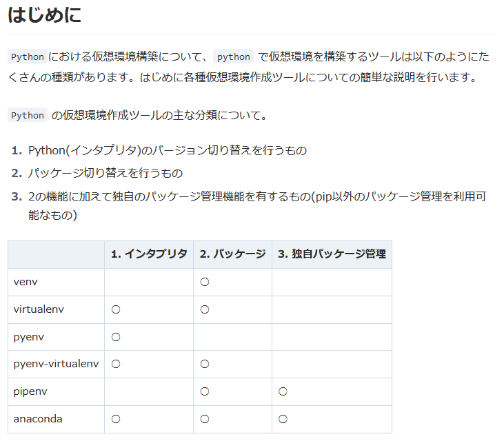
    * https://qiita.com/KRiver1/items/c1788e616b77a9bad4dd#pyenv-virtualenv%E3%82%92%E3%82%84%E3%82%81pipenv%E3%82%92%E4%BD%BF%E3%81%86

構築手順は以下を参考にする。

* https://zenn.dev/unemployed/articles/cc111706c3167c

* 実施手順
    1. `Anaconda Prompt (miniconda3)` を立ち上げる
    1. `conda create -n DataScienceCompe2022_eLearning python` で仮想環境を作成
        * condaをupdateしたほうがよいみたいなことを言われるが無視する  
        * C:\Users\ユーザ名\.conda\envs\DataScienceCompe2022_eLearning のようにフォルダが作られる
        * インストールするパッケージがずらずら表示されるが、base側の話なのかよくわからない
            * 実行前後でbase側の `conda list` を比較したが特に差分なかったので、仮想環境側の話のようだ。
    1. 環境作成・パッケージインストール後、`conda info -e` で作った仮想環境一覧が見れる
    1. `conda activate 環境名` で仮想環境に入る（source activate 環境名は古い書き方っぽい）
    1. `pip freeze` でインストール済みのパッケージ一覧を確認
        * インストールされている内容がめちゃシンプル
    1. `conda deactivate` で仮想環境を抜ける
    1. `conda remove -n 環境名 --all` で環境を削除できる

* 追加で入れるパッケージ
    1. `Anaconda Prompt (miniconda3)` を立ち上げる
    1. `pip install jupyter notebook`
        * ネット見ると、`conda install notebook ipykernel` の手順も必要なように書かれているが、特にやらなくても jupyter notebook からpythonは動いている模様（過去にAnaconda入れていたからかもしれない）
        * jupyterの起動は `jupyter notebook` のようにするとブラウザが立ち上がるところまで自動で動く
    1. `pip install numpy pandas pandas-profiling seaborn sklearn xgboost` を実行
    1. `pip install -U imbalanced-learn`
        * SMOTE
    1. `pip install -U plotly`
    1. `pip install -U lightgbm`

* Visual Studio Community 2022での設定
    * ソリューションエクスプローラで `Python環境` -> `環境を追加`  
    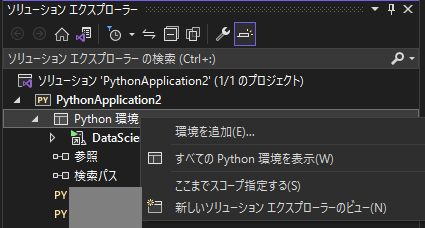
    * `環境を追加` -> `既存環境` で（baseでない）仮想環境のフォルダを設定すると勝手にVSに認識される  
    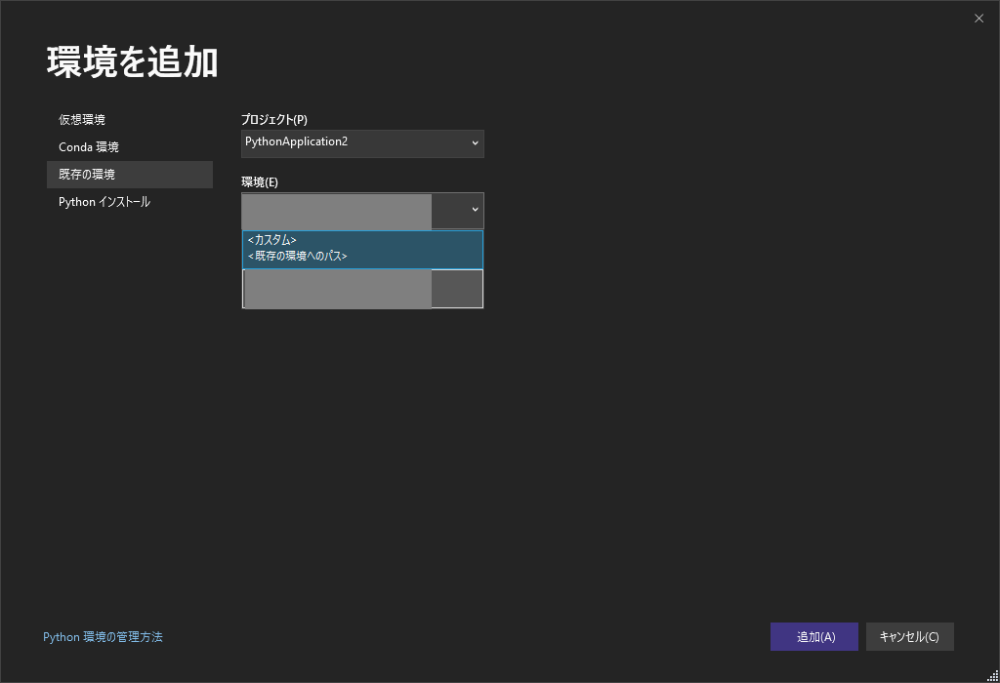

## ipynbのビューア

* Visual Studio Community 2022 + 拡張機能Notebook Editor
    * https://marketplace.visualstudio.com/items?itemName=MLNET.notebook
    * まだプレビュー版なせいなのかわからないが動きが遅くて実用する気になれない
* Visual Studio Code
    * ブラウザで開くときと同様の感覚で使えるが、ダーク系のテーマだとグラフが見づらい・・・
        * ipynbのときだけライト系で、がっつりコーディングするときはダーク系がいい
        * ワークスペースで設定変えればいいのか？
            * https://prius.cc/itya/20181218_vscode-workspace
    * *.pyで書いて、その後にipynbに変換する方法もある
        * https://qiita.com/komiya_____/items/547ae8b5a9b031f18b59

## Visual Studio Community 2022ノウハウ

* グラフ化、可視化
    * 適当なところでブレークポイントで止めた状態でイミディエイトウィンドウで `sns.histplot(x="BILL_AMT1", data=data, element='step')` のように実行するとその場でグラフ見れる  
    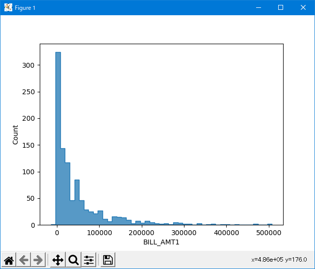
    * グラフのウィンドウを複数枚出したいときは以下のように一度plt.figure()を呼び出せばとりあえずできる（もっとカッコいいやり方がありそうな気はする）
        ```
        plt.figure()
        sns.histplot(x="BILL_AMT1", data=data, element='step')
        ```

## Visual Studio Codeノウハウ

* グラフ化、可視化
    * 適当なところでブレークポイント置くパターン
        * デバッグコンソールで`sns.histplot(x="BILL_AMT1", data=data, element='step')` のように実行するとその場でグラフ見れる
* 拡張機能
    * indent-rainbow
        * インデント階層の可視化
        * デフォルトよりは見やすくなるので無いよりはあったほうが良い
    * Pylance
        * https://forest.watch.impress.co.jp/docs/news/1324425.html
        * 型チェックを有効化する
            * デフォルトだと無効
            * VS Codeの設定画面から `python.analysis.typeCheckingMode` をbasicもしくはstrictに設定
    * IntelliCode
        * AI支援インテリセンス
        * Python, Java, TypeScript, JavaScript対応
    * Python Indent
        * インデント挿入
    * autopep8: 保留
        * コードフォーマッタ
    * flake8: 保留
        * lint
    * todo tree
        * todoリスト
        * コード上で `#TODO foobar` と入れるとTODOsパネルに表示される
    * Zenkaku: 保留
        * 全角スペース表示
    * autoDocstring - Python Docstring Generator
        * docstring
        * dostring formatはとりあえずgoogleスタイルで
        * ctrl + shift + 2 で自動挿入される
    * python-snippets
        * https://marketplace.visualstudio.com/items?itemName=frhtylcn.pythonsnippets
        * とりあえずスニペットないとめんどくさいので適当なものを入れてみる
* 設定
    * コマンドパレットで以下設定
        * files.insertFinalNewline
            * 保存時にファイル末尾に改行を入れる
        * editor.renderControlCharacters
            * 制御文字表示
        * Python: Language Server
            * とりあえず Pylance を指定してみる
        * Pylance / Python › Analysis: Auto Import Completions
            * 意図しないimport文が挿入されることがあるの、これのせいかも
            * OFFにしたい気がする
* インテリセンス系
    * 関数情報等: `ctrl + i` or `ctrl + k -> ctrl + i`
    * `ctrl + k -> ctrl + i` の方がシグニチャ情報などが見やすいしたぶん全部見れてる
    * `ctrl + space` は本家Visual Studioと同じ

## あとで詳細読んでおきたいメモ

* Kaggleで書いたコードの備忘録
    * https://qiita.com/pocokhc/items/add4948aa0ff858218f8
    * https://qiita.com/pocokhc/items/0b6b6534ab984bb87ac4
    * https://qiita.com/pocokhc/items/56273f40f57679f25341

## 書籍

* 気になっている
    * O’Reilly: ゼロから作るDeep Learning
    * [第3版]Python機械学習プログラミング 達人データサイエンティストによる理論と実践
    * Kaggleで勝つデータ分析の技術
        * https://github.com/ghmagazine/kagglebook

* 読了
    * Kaggleのチュートリアル第６版
        * Titanicでkaggleへの初Submit、さらに学習の基本的な流れが参考になった
        * https://www.currypurin.com/tutorial_ver6_support
    * kaggleで上位に入るための探索的データ解析入門
        * データの種類ごとの考慮点、箱ひげ図、バイオリン図のサンプルがよかった

* あとで読み直す
    * Pythonで動かして学ぶ！ あたらしい機械学習の教科書 第2版

